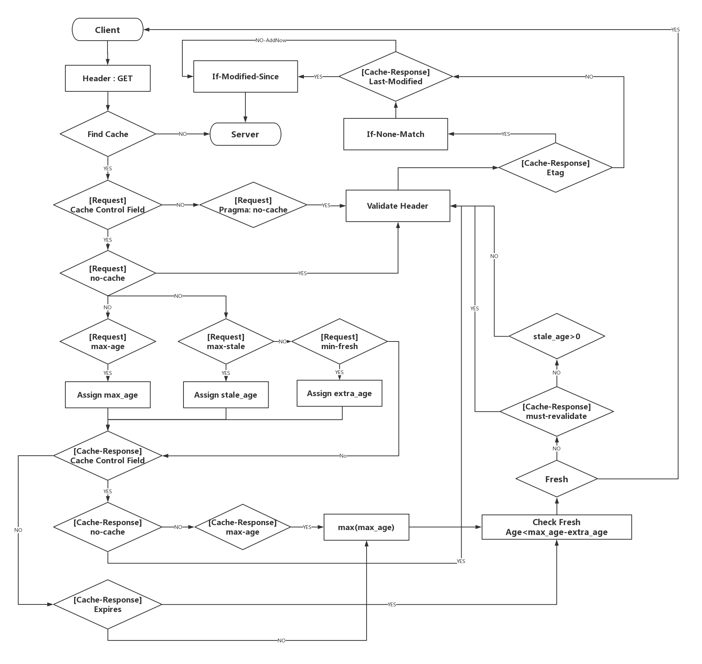

# erss-hwk2-aw343-wl177

This project is for ECE-568 Homework2
For this assignment you will be writing an http proxy – a server whose job it is to forward requests to the origin server on behalf of the client. Your proxy will cache responses, and, when
appropriate, respond with the cached copy of a resource rather than re-fetching it. 

## Summary

**For Details, please checkout our [Requirement Spreadsheet](https://gitlab.oit.duke.edu/wl177/erss-hwk2-aw343-wl177/src/SpreadSheet.xlsx)**

### Proxy
1. Support GET
2. Support POST
3. Support CONNECT

### Cache
1. Cache appropriate responses
2. Follow the rules of expiration time
3. Follow the rules of re-validation (e.g. no-cache)
4. Good Cache Maintainance (e.g. Size, LRU Evict)

### System 
1. Multithread to handle a request
2. Synchronization for our caches
3. A Deamon log file to record required information
4. Good C++ OO Design
5. Exception Guarantee
6. Docker

## Design

### Cache Validate Procedure

### Flow Chart

## Getting Started
These instructions will get you a basic idea of how to run the web

### Docker Installation

### Run the Cache-Proxy
1. git clone https://gitlab.oit.duke.edu/wl177/erss-hwk2-aw343-wl177.git
2. 

## Function Introduction

## Reference

* [Hypertext Transfer Protocol (HTTP/1.1): Semantics and Content](https://tools.ietf.org/html/rfc7231)
* [Hypertext Transfer Protocol (HTTP/1.1): Caching](https://tools.ietf.org/html/rfc7234) 
* [Hypertext Transfer Protocol (HTTP/1.1): Message Syntax and Routing](https://tools.ietf.org/html/rfc7230) 

## Authors

* **Wending Lin** (NetID: wl177)
* **Anqi Wang** (NetID: aw343)